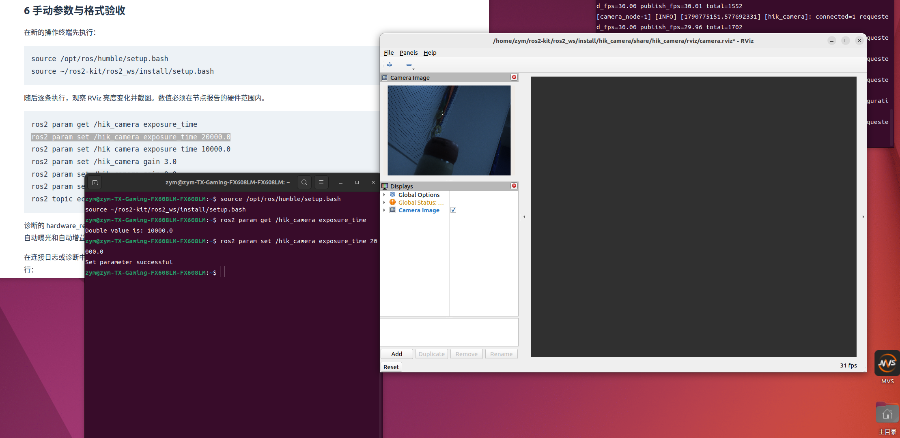
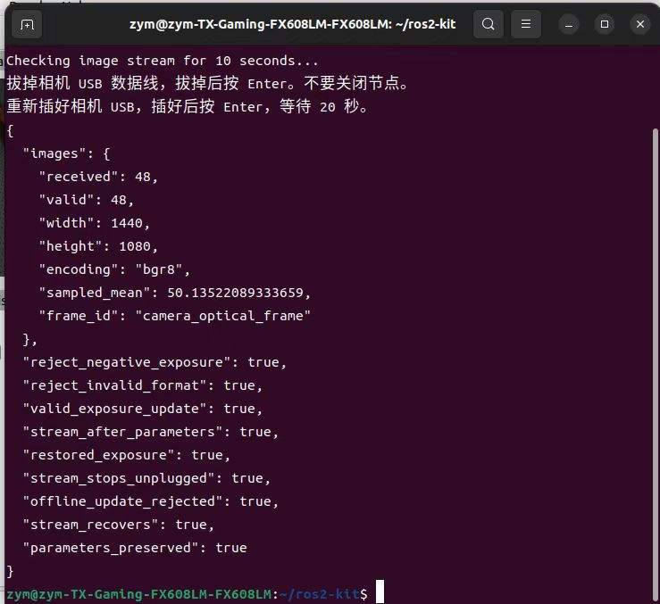
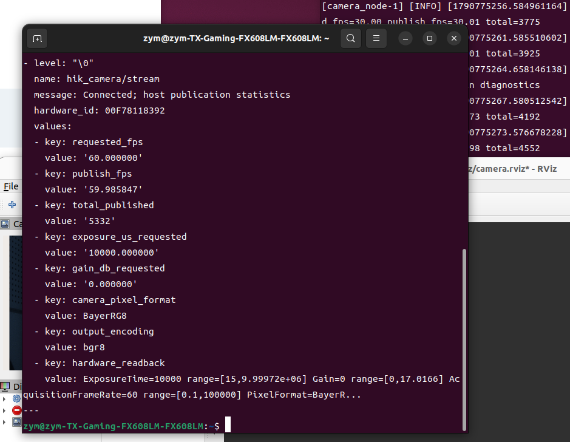

# 海康工业相机 ROS 2 功能包成果验收报告

## 项目成果

本项目以海康 MV-CA016-10UC 工业相机为对象，在 Ubuntu 22.04 与 ROS 2 Humble 环境下完成了厂商 MVS SDK 的 ROS 2 封装。相机数据通过标准 `sensor_msgs/msg/Image` 接口发布，可由 RViz 直接订阅显示；节点同时提供参数配置、运行状态诊断和设备断线恢复能力。

交付内容包括可构建的功能包源码、Python Launch 文件、YAML 参数文件、RViz 配置、模拟后端测试，以及真实设备测试日志和截图。

## 任务要求与实现对应

| 任务内容 | 实现方式 | 验证情况 |
|---|---|---|
| 设备发现与连接 | 枚举 USB 工业相机，按完整序列号匹配并打开设备 | 已验证实际设备连接 |
| 标准图像发布 | SDK 获取图像并转换为 bgr8，填充尺寸、步长、时间戳与 frame_id | 已验证 1440×1080 图像消息 |
| 可配置话题 | 使用 image_topic 启动参数配置图像发布名称 | 已实现；默认 /image_raw 已使用 |
| 相机参数管理 | 曝光、增益、帧率、像素格式四类 ROS 参数接口 | 曝光与帧率已有实测；其余范围见报告末尾 |
| 动态参数保护 | 范围检查、SDK 返回值检查、失败回退、离线拒绝 | 自动检查通过 |
| 断线重连 | 释放失效句柄，定时重新枚举并连接同一序列号 | 真实拔插检查通过 |
| 配置恢复 | 重连后重新应用最后成功的受管理配置 | 连接日志记录硬件读回 |
| 一键启动 | Launch 加载参数，支持同时启动 RViz | 已通过实际启动验证 |
| 工程交付 | package.xml 声明 ROS 依赖，CMake 配置构建及安装，README 说明 SDK 安装 | 已提供源码与使用说明 |

## 真实设备测试结果

### 构建和测试

在 Ubuntu 上执行 `colcon build` 成功完成构建；随后执行自动测试，结果为 **1 项测试通过，0 错误、0 失败**。该测试在内部覆盖设备匹配、参数范围、部分写入失败回退、采集启停失败恢复、图像缓冲释放及重连恢复等分支。

这里的自动测试是模拟 SDK 测试；下面的图像和拔插结果来自独立的真实设备操作。

证据：[构建与测试日志](evidence/build-20260930-214154.log)。

### 图像发布与可视化

真实相机发布的图像规格为 **1440×1080、bgr8**。随包完整检查记录接收到 **48 帧**，全部通过消息布局检查。该帧数属于本次检查窗口的接收统计，不作为相机最高帧率指标。

RViz 已显示真实场景图像，曝光参数从 10000 微秒调整到 20000 微秒的命令返回成功。

### 参数校验与故障恢复

随包真实设备检查记录中，下列项目均返回 `true`：

| 检查项 | 结果 |
|---|---|
| 拒绝负数曝光参数 | 通过 |
| 拒绝无效像素格式名称 | 通过 |
| 合法曝光参数更新 | 通过 |
| 参数操作后继续输出图像 | 通过 |
| 测试完成后恢复原曝光参数 | 通过 |
| 拔掉 USB 后停止接收新图像 | 通过 |
| 设备离线期间拒绝参数更新 | 通过 |
| 插回 USB 后恢复图像接收 | 通过 |
| 重连后保持原曝光参数 | 通过 |

证据：[真实设备检查记录](evidence/check-20260930-214547.json)。

随包[运行日志](evidence/run-20260930-214449.log)进一步记录了重连后重新应用的硬件值：曝光 20000 微秒、增益 0、帧率请求 30、BayerRG8。该记录补充了“ROS 参数保持不变”之外的设备侧读回证据。

### 帧率配置与运行诊断

节点提供请求帧率、实际发布帧率、累计发布帧数和硬件参数读回，能够区分“设置值”与“实际运行值”。实际运行记录包含约 30 fps 和约 60 fps 的发布阶段；其中一张诊断截图记录请求值 60 fps、发布值 **59.985847 fps**。

此结果说明 60 fps 配置下曾达到对应发布速率，不将该单次读数作为持续稳定性能或设备极限帧率结论。

## 工程实现要点

- **设备访问与 ROS 节点分离**：SDK 连接、配置及取帧集中在相机封装层，ROS 节点负责参数、消息与运行状态管理。
- **参数更新包含恢复逻辑**：设置失败时尝试恢复上一次成功配置，避免部分参数更新后状态不一致。
- **图像转换与缓冲释放配套**：使用 SDK 转换 Bayer 等输入格式；转换异常时仍释放借用的 SDK 图像缓冲。
- **配置与代码分离**：Launch 与 YAML 管理启动配置，无需为修改常用参数重新编写节点。
- **结果可追溯**：源码、测试日志、检查 JSON 和实际图像截图随包提供，便于核对实现与运行结果。

## 验收边界及改进方向

已验证成果集中在采集发布、曝光调节、参数校验、可视化和断线恢复。当前版本仍有三项需完善：增益 3.0 在读回校验中被拒绝并回退；不同合法像素格式切换尚缺实测证据；后段出现通信报错与帧率下降，持续性能未完成验证。初次构建存在一处 signed/unsigned 比较警告。上述边界已保留在原始证据中，未列为验收通过。
